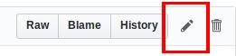
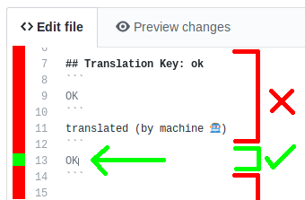
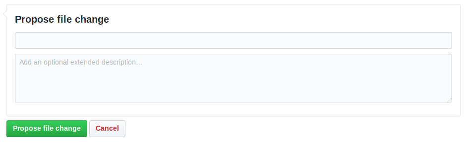
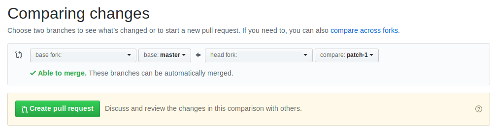

# Map Marker app translations

This repository is aimed to host all Map Marker app translations, and provide access to anyone to contribute to those translations.

To contribute to translations you need to understand English because the source of the translation is English.

You can edit just one line of translation, or all the translations of the file, it's up to you. Any progress with the translations will help me. Thank you in advance :-)

## Submitting translation edits
Whether you want to just translate one sentence, or an entire language, you can do this here in just a few steps:
* First you will need to [create](https://github.com/join) a github account to be able to suggest edits
* Click on your language from the [languages list](#Translation-languages-list). This will take you to the associated language's translation file page.
* From the translation file page, click the "Edit" button at the top right, as highlighted in this image.

* Edit as many translations as you like (between the lines containing "\`\`\`") as indicated by the arrow below.

* IMPORTANT: don't edit anything else than the translation itself, either before, inside, or after the separator lines. You can put multiple lines between the "\`\`\`", and line returns will be counted into the translation. To avoid text encoding issues, you need to use the online editor. If the text is not encoded properly, the result will be unusable and the online editor will make sure the encoding is correct. If you're familiar with text encoding and want to use your own text editor, then that's fine as long as you use UTF-8 encoding.
* Once you're happy with the changes scroll down to the bottom of the page and click the green "Propose file change" button as shown in the image below. If you want me to credit you in the app's "Thank you" section, you can leave your name or nickname in the description box shown in the image below.

* That will take you to the next page allowing you to submit a pull request by clicking the green "Create pull request" button as shown in the image below.

## What happens after the edit submission?

Once you have submitted a translation edit, I will receive an email and all your changes, and I will be able to review your translations and integrate them. You will be notified by email when I accept your changes.

## Translation languages list

[Arabic (80% human-translated)](./translations/ar_strings.md)

[Bulgarian (0% human-translated)](./translations/bg_strings.md)

[Catalan (0% human-translated)](./translations/ca_strings.md)

[Chinese Simplified (1% human-translated)](./translations/zh-rCN_strings.md)

[Chinese Traditional (1% human-translated)](./translations/zh-rHK_strings.md)

[Chinese Taiwan (27% human-translated)](./translations/zh-rTW_strings.md)

[Croatian (0% human-translated)](./translations/hr_strings.md)

[Czech (0% human-translated)](./translations/cs_strings.md)

[Danish (29% human-translated)](./translations/da_strings.md)

[Dutch (95% human-translated)](./translations/nl_strings.md)

[Finnish (0% human-translated)](./translations/fi_strings.md)

[German (78% human-translated)](./translations/de_strings.md)

[Greek (0% human-translated)](./translations/el_strings.md)

[Hebrew (0% human-translated)](./translations/iw_strings.md)

[Hindi (0% human-translated)](./translations/hi_strings.md)

[Hungarian (0% human-translated)](./translations/hu_strings.md)

[Indonesian (0% human-translated)](./translations/id_strings.md)

[Italian (0% human-translated)](./translations/it_strings.md)

[Japanese (0% human-translated)](./translations/ja_strings.md)

[Khmer (0% human-translated)](./translations/km_strings.md)

[Korean (0% human-translated)](./translations/ko_strings.md)

[Latvian (0% human-translated)](./translations/lv_strings.md)

[Lithuanian (69% human-translated)](./translations/lt_strings.md)

[Norwegian (0% human-translated)](./translations/no_strings.md)

[Polish (78% human-translated)](./translations/pl_strings.md)

[Portuguese (0% human-translated)](./translations/pt_strings.md)

[Romanian (0% human-translated)](./translations/ro_strings.md)

[Russian (78% human-translated)](./translations/ru_strings.md)

[Serbian (0% human-translated)](./translations/sr_strings.md)

[Slovak (0% human-translated)](./translations/sk_strings.md)

[Slovenian (77% human-translated)](./translations/sl_strings.md)

[Spanish (0% human-translated)](./translations/es_strings.md)

[Swedish (78% human-translated)](./translations/sv_strings.md)

[Thai (0% human-translated)](./translations/th_strings.md)

[Turkish (0% human-translated)](./translations/tr_strings.md)

[Ukrainian (17% human-translated)](./translations/uk_strings.md)

[Vietnamese (0% human-translated)](./translations/vi_strings.md)

